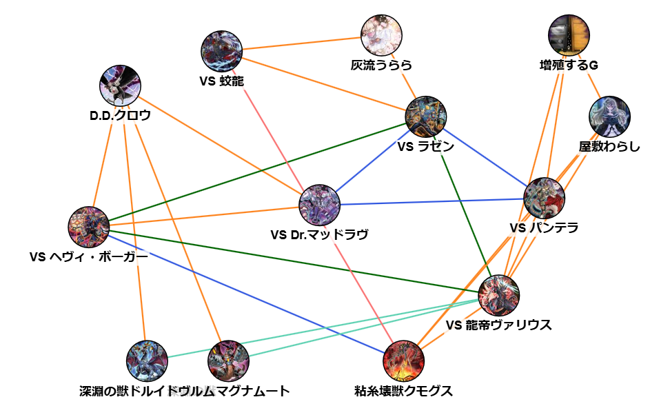
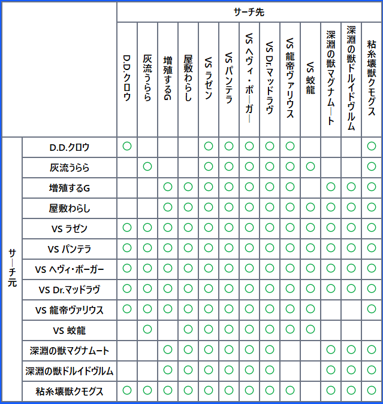

# Yugioh Small World Seacher

## About

The "Yu-Gi-Oh! Small World Searcher" is a tool that visualizes the cards in a deck that can be searched using "[SmallWorld](https://www.db.yugioh-card.com/yugiohdb/card_search.action?ope=2&cid=16555)".
This application is available on [this web site](https://pystyle.info/apps/yugioh-small-world-searcher/).





## Feature

- デッキ内でサーチ可能なパスをグラフで表示
- デッキ内でサーチ可能なパスをテーブルで表示
- 中継ぎカード検索

## Project setup

```
npm install
```

### Compiles and hot-reloads for development

```
npm run dev
```

### Compiles and minifies for production

```
npm run build
```
